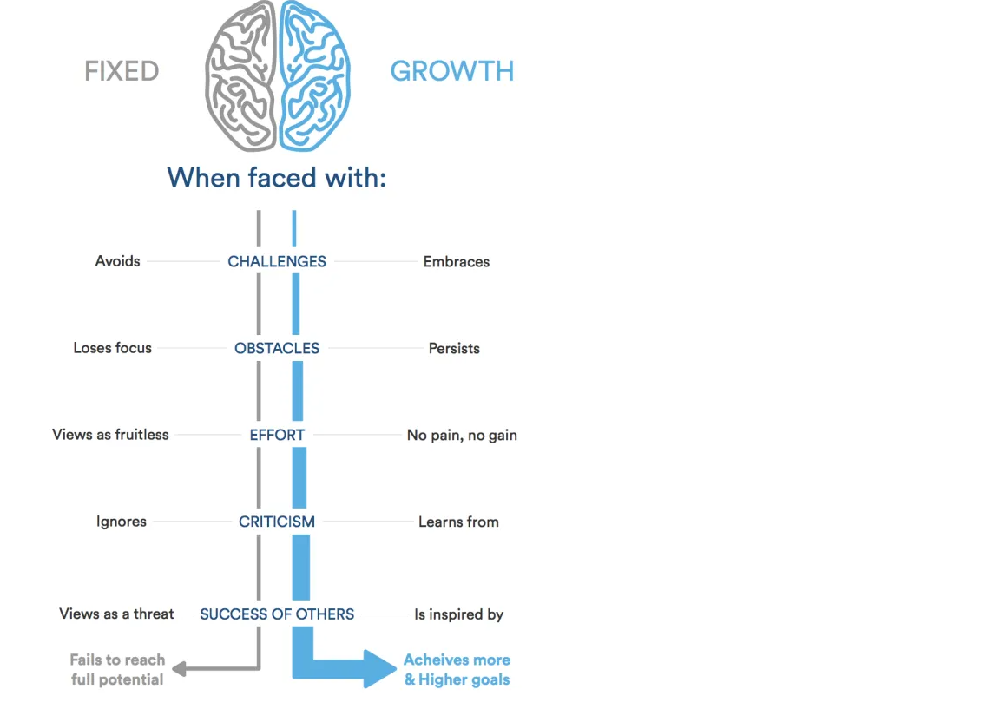

# reading-notes
 # Growth Mindest

_our mind is the engine of our body and control our movment and reactions and feelings in our life
and to make our enviroment full of posetive energy and keep walking over proplems and obstecels we need something called growth mindest_ 
### What's the difference between fixed mindest and growth mindest
* **fixed mindest:** _people believe their basic qualities, like their intelligence or talent, are simply fixed traits. They spend their time documenting their intelligence or talent instead of developing them. They also believe that talent alone creates success_
* **growth mindest:** _people believe that their most basic abilities can be developed with dedication and hard work—brains and talent are just the starting point. This view creates a love of learning and a resilience that is essential for great accomplishment._

### why its important
**growth mindest is important in work life and outwork life,in work you will find the solution of the obstecls and proplem you face,and make you faceing it with no negative thinking, make you grow front of you maneger if you are an employee and front of your employees if you have a compeny,its so satisfying to the smile in your fac when you go home or at work**
### what to remember
* **you will face and walk wthrough the proplems**
* **you will grow in your comunity and work**
* **you will be open minded**
* **the smile will never leave your face**

[for a deeper information](https://www.brainpickings.org/2014/01/29/carol-dweck-mindset/)

_my name is **Malik Mahmoud Swayyed** Iam 28 Mechanical Engineer
have a device with Windows 10 pro 64 bit
programming was a hoppy for me but now with course i can do much more and learn what is usefull to start my way_
[GitHub account](https://mechengmalik.github.io/README/)
