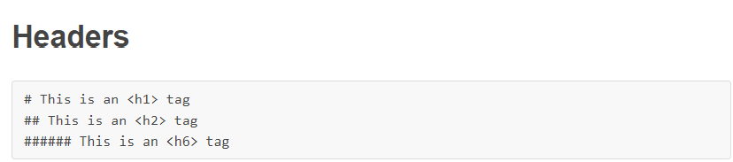
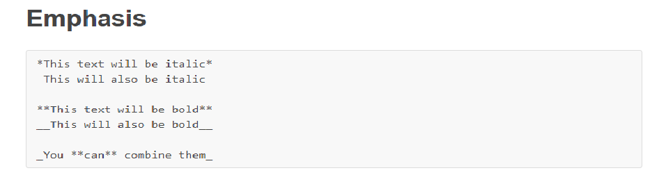
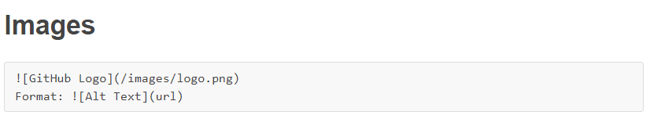
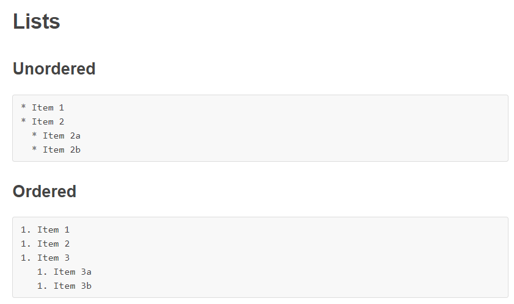
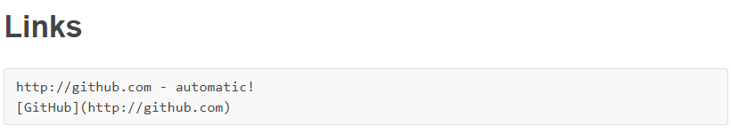

# read01.md
# Github Pages Is Your First Step
----------------------------------------------------------------------------------------------------------------------------------------------------------------------------
_GitHub is  a code hosting platform for collaboration and version control,can make your work shine to the world and let evryone watch your dream come true,this website that use a ligthwaigh language called_ **Markdown**, _and you can in short time make your own page on the web in a simple steps, because the work will be easy with a Professionals and those interested in the same field,github is the ypue place for this while it is a container for this comunity._

### what you should know about Github pages
_GitHub Pages are public webpages hosted for free through GitHub. GitHub users can create and host both personal websites (one allowed per user) and websites related to specific GitHub projects. Pages lets you do the same things as GitHub, but if the repository is named a certain way and files inside it are HTML or Markdown, you can view the file like any other website. GitHub Pages is the self-aware version of GitHub. Pages also comes with a powerful static site generator called Jekyll,Like GitHub Pages, Jekyll is self-aware, so if you add folders and files following specific naming conventions, when you commit to GitHub, Jekyll will magically build your website._
### How To Markdown
_we said previusly that the language in **github** is **HTML** and **Markdown**,but mostly the **Mardown** is enough and this is how its done._

   

**how to make the header for the page**

   

**here you can define the type of you font when you writ a text**

   

**if you want to insert an image in the page writ this form**

   

**if you want to make a list or steps**

**this form is for inserting a url for a specific web address**

[for more tips and info click here](guides.github.com/features/mastering-markdown/)

[visit github now](https://github.com)

